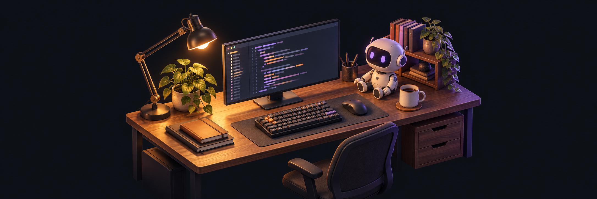

<h1 align="center">Oscar's Lab</h1>

A little space for code, curiosity, and experiments.

  

## Hey, I'm Oscar 👋

I enjoy building useful things and figuring out how they work.  
Usually somewhere between backend, AI, and a new experiment.

### Things I enjoy building

- Small tools that solve everyday problems.
- AI agents and useful automations.
- APIs and the systems behind them.

### My toolbox

  
  
  
  
  
  

### On my workbench

**🔨 In development · Tattoo studio automation**  
Building an automated journey for tattoo studios, from attracting and managing leads to collecting deposits and booking appointments directly into each artist's calendar.

**🌱 In planning · A smarter study companion**  
Planning an app that uses an adaptive study algorithm to schedule spaced repetition for students, so they can focus on learning while their assistant handles the review schedule.
